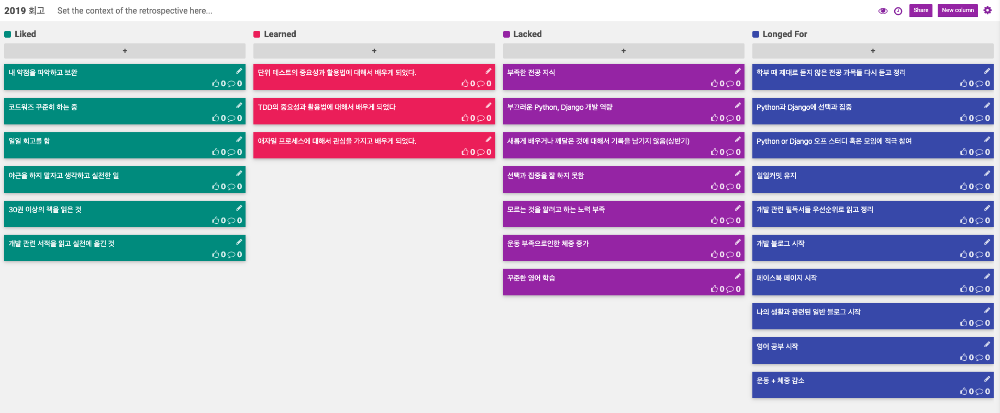
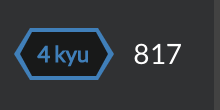
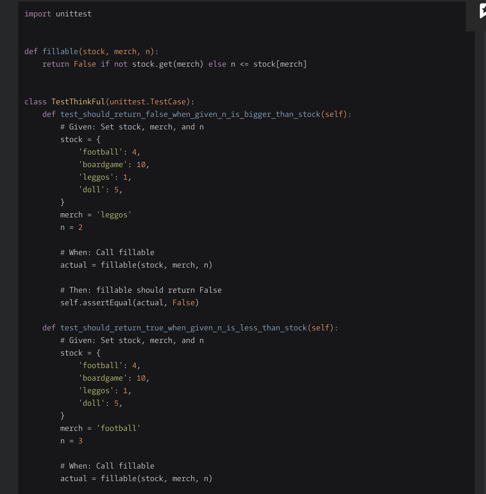

# 2019년 회고

## Event

### 알바 생활

 2018년도 초부터 약 9개월 간 게임회사에서 교육 및 인턴생활을 한 후, 큰 자신감을 가지고 공채시즌에 지원을 했지만 결과는 좋지 않았다. 그래서 예상치 못하게 12월 중순 부터는 알바를 할 수 밖에 없는 상황이 되었고, 12월 중순 부터 인턴 합격 발표가 난 3월 중순 까지 약 3개월 동안 무직 상태에서 알바를 하게 되었다.

### 인턴 합격

 3월 중순 쯤에, 내가 현재 다니고 있는 회사의 인턴 지원에 합격을 하게 되었다. 작년에도 똑같은 과정에 지원했다가 1차 면접에서 떨어진 이후, 다시 지원을 하였는데, 운 좋게도, 1차, 2차 면접까지 볼 수 있었고, 결과를 기다리고 있었다.

그런데, 최종결과는 불합격이였고, 다시 알바할 준비를 하려고하는 순간, 이틀 후 다시 연락이 와서 추가 합격이 되었다.

매우 운이 좋게도, 추가 합격으로 선발이 되어서, 3월 18일 부터 인턴 생활을 하게 되었다.

* 학원

  3월 중순부터 4월 중순 까지 1개월 간은 학원에서 수업을 들었다. 현업에서 인턴을 교육할 시간과 자원이 부족하다보니, 내려진 결정인 것 같았다. 근데 개인적으로 학원에서의 수업은 최악이였다. 구글에 흔히 돌아다니는 튜토리얼을 한달 동안 하면서, 강의료는 60~70만원 선인 것이.. 모르는 사람들 대상으로 통수 치는 것 같아서 굉장히 안좋게 느껴졌고, 물론 수업 퀄리티 라던지, 내용도 너무 안좋아서, 사실 나는 이때 수업듣지 않고 내가 하고 싶은 일을 하였다. 시간이 너무 아까웠다.

* 프로젝트

   그렇게 약 1개월 간 교육이 끝난 후, 회사로 출퇴근 하며 프로젝트를 하였다. 학원과 비교했을 때, 이떄는 나에게 천국이였다. 3명이서 팀 프로젝트를 수행하였는데, 회사 프로세스를 어느 정도 따르면서, 프로젝트를 수행하는 것이 매우 재미가 있었다. 그리고, 무엇보다도 코드리뷰 문화가 있어서, 내가 작성한 코드에 대해서 다른 사람이 리뷰를 해주는 것에 대해서 처음으로 경험해보게 되었고, 그동안 내가 무엇을 잘못했고, 어떻게 나아가야하는지에 대해서, 리뷰를 통해서, 많이 배울 수가 있어서 너무 좋았다. 프로젝트를 수행하면서, 잘 안되는 것도 많았고, 짜증이난 적도 있던적도 있었지만, 전체를 돌이켜 보았을 때, 새롭게 접하게된 회사의 매우 좋은 문화들을 직접 접하고 경험해볼 수 있어서 나에게 매우 좋은 경험이었다.

* 면접

   작년과 다르게 올해 정책이 바뀌어서, 인턴이 끝나고도, 면접을 2번더 보게 되었다. 기술과 임원면접을 보았는데, 개인적으로 나의 민낯을 적나라하게 보게 되어서, 어느 한편으로 매우 부끄럽기도 하였고, 어느 한편으론 나의 약점과 내가 잘 못하고 있던 것에 대해서 확실히 알 수 있던 면접이라서 의미가 있었다.

### 정직원 전환

 결론적으로 약 4개월 간의 인턴이 끝나고, 정직원으로 전환이 되었다. 면접 단계에서, 떨어질 것 같았는데, 붙어서 위에서 언급한대로 부끄러움과 내 약점을 알았기 때문에 앞으로 더 열심히 잘해야겠다라는 생각을 가지게 되었다.

### 회사 생활

 내가 면접을 볼 때, 가장 크게 느낀 부끄러운 점 중에 하나는 전공 기초 지식에 대한 부족과 Python에 대한 역량 부족, 그리고 인턴하는 동안, 그리고 내가 여태까지 학습해왔던 것에 대해서 어떠한 기록도 남기지 않은 것이였다.

사실 2018년 1년 동안, 2010~2017년을 합친 것보다 더 열심히 개발 관련 학습을 하였다고 생각하는데, 그런 학습과 관련된 기록을 전혀 남기지 않았고, 알고리즘 문제 풀이도 하다말다 깔짝깔짝, 블로깅도 했다가 안했다가 하였기 때문에, 전혀 내세울게 없었고, 그 결과 면접에서, 무언가 의도적인 노력을 들여서, 배우려는 의지가 있는 지에 대한 의문이 든다는 피드백을 받았었다. 전공관련 공부도 조금씩 계속 해오고 있었고, 개인프로젝트도 진행하고 있었고, 개발관련 서적도 꾸준히 읽고 있었지만, 면접에서 제대로 된 답변을 전혀 못하였기 때문에, 당연한 피드백이라고 생각했다.

그래서, 입사를 하고 난 이후에는 내가 하고 있는 모든 활동에 대해서 기록을 남기자는 결심을 하게 되었다. 그렇게 매일매일 일일회고 형식으로 기록을 남기게 되었다.

형식은 인턴을 하면서, 처음해보게된 회고의 형식을 가져와서 조금 수정하였다.

오늘 할 일, 새롭게 배운 것, 특별한 이벤트, 반성해야 할 것, 액션 아이템 의 영역으로 나누어서, 7월 중순부터, 12월 중순까지 진행하였다.(현재는 2주간 작성을 못하고 있다.. 다시 시작해야한다.)

확실히, 이렇게 기록을 남기기 시작하면서, 내가 무엇을 했고, 무엇이 부족하였고, 앞으로 어떤 것을 개선해야하는지에 대해서 확실히 알 수 가 있었고, 다른 사람이 볼 때도, 내가 어떻게 하고 있는지, 얼마나 노력하고 있는지에 대해서 파악할 수 있어서, 서로서로 이득이 되었던 것 같고, 현재 개인적으로 TIL을 진행할 때 같은 형식으로 진행하고 있다.

### KPJ 활동

KPJ 활동은 내 친구들과 함께한 개발 모임이다. 서비스를 같이 만들고 출시하는 일을 한다.

2018년 3월에 시작해서, 매주 한번 모이기 시작하였고, 사실 어떤 서비스를 제대로 만들어서 출시한적은 없지만, 하면서, 배우거나 느낀점이 많았다. 실패를 통해서 배우는 것이 많았기 때문에, 끊기지 않고 계속하고 있었다.

그러나, 최근에는 어느정도 한계에 봉착하게 된 것 같은데, 아무래도 세명 다 직장을 다니다 보니, 시간을 내기 힘든 것도 있고, 새로운 기술 트렌드에 대해서 적응을 바로바로 하지 못한점도 있다. 그러다보니, 기술적인 구현에 문제가 생기다보니, 학습과 구현을 같이해야하는 문제가 생겼고, 프로젝트가 자꾸 지연되었다.

개인적으로는 나도 회사 일및, 회사 일을 더 잘하기 위한 나의 개인 개발 공부도 있다보니, 신경을 많이 쓰지 못하였고, 새로운 기술스택을 쓰다보니, 해당 기술을 파악하는데에 많은 시간이 걸리는 문제가 생겼고, 그 사이 다시 트렌드가 더 발전해버리거나, 패치로 인한 라이브러리 의존, 등등 여러가지 문제가 복합적으로 발생하면서, 실질적 구현을 거의 하지 못하였다. 나의 역량이 높지 않다보니, 그 상태에서, 무언가 리드해서 이끌어가기가 쉽지 않았다.

현재는 개인역량 발전을 위해서 잠시 쉬고 있는 중인데, 개인적으로 아쉽고, 내년에 어떤 식으로 다시 운영해야할지 고민이 크다.

# 4Ls

## Liked

### 내 약점을 파악하고 보완하는데 신경을 많이 씀

#### 코드워즈

올해 10월달 부터 코드워즈를 시작하였다. 내가 이것을 하게된 이유는 나는 알고리즘 시험에 대한 일종의 공포심이 예전부터 있었다. 알고리즘을 잘 못하다보니, 이걸로 계속 스트레스를 받고, 나중에는 알고리즘 시험 소리만 들어도 심장이 뛰는 느낌이 났던 적도 있었던 것 같다. 그래서 나의 이런 약점을 파악하고 고치기 위해서, 회사분들도 많이 하는 코드워즈를 시작하게 되었다.

올해 내에 1000점 돌파가 목표로 하루에 10점 올리기를 하였는데 아쉽게도 800점 대에서 멈추게 되었다.

<2019년 12월 29일 현재 817점을 기록하고 있다.>

그러나, 실제로 이것을 하면서, 알고리즘 시험에 대해서 꽤나 울렁증이 줄어들었다. 물론 잘 푸는 것은 아니지만, 그 이전보다는 나아졌다고 확신을 한다. 또한 문제를 풀면서 거의 모든 문제에 TDD를 적용해서 풀려고 해보았는데, TDD를 연습하는데 매우 좋은 효과가 있었다.

<매우 쉬운 문제이지만, TDD로 풀어 보았다.>

내년에도 마찬가지로 하루 10점씩 하여서, 얼추 3000점을 넘는 것을 목표로 할 것이다.

### TDD를 시작

 회사에서, 첫 티켓을 할 때, 페어프로그래밍으로 처음 TDD를 접하게 되었다.

TDD에 대해서 예전부터 알고 있었지만, 내가 가장 궁금했던 사실은 '아니 이걸 도대체 어떻게 써먹는가?' 라는 것이였다.

테스트를 먼저 짠 이후에, 구현을 한다는 것이 나 스스로에게는 이해하기 힘든 개념이였고, 도입 해볼 엄두가 나지 않았었다.

그런데, 페어로 TDD를 진행을 해보니, TDD에 장점에 대해서 확실히 알 수 있게 되었고, 그 이후엔 내가 작성하는 모든 코드를 TDD로 작성하려고 노력 중이고, 이게 몇개월 되다보니, 이제는 TDD를 하지 않으면, 코드를 짤 수 없는 정도에 이르렀다.

또한 예전에 잘 이해가 되지 않던 TDD 서적들이 매우 잘 읽혀서 너무 좋았고, 앞으로도 TDD를 더 잘 할 수 있도록 더 노력할 예정이다.

### 일일회고를 함

회사에서 정직원으로 전환된 이후에, 하루 단위로 오늘 할 일, 새롭게 배운 것, 특별한 이벤트, 반성해야 할 것, 액션 아이템에 대해서 기록을 남기기 시작하였고, 현재는 회사 생활 이외, 개인적인 하루를 기록하는 용도로 일일 회고를 활용하고 있다.

요즘들어서는 사실 매일매일 하지는 못하고 있지만, 그래도 일일회고를 꾸준히 진행하면서, 내가 무엇을 배웠고, 앞으로 어떻게 나가야 하는지에 대해서, 멘탈을 놓치지 않고, 계속적으로 이어나갈 수 있었던 것 같다.

### 야근을 하지 말자고 생각하고 실천한 일

예전부터 나는 어떤 일을 잘하기 위해서는 절대적인 시간투자가 필요하다고 생각해왔다. 그래서, 2018년 작년 기준에서도, 인턴으로써, 회사 일에 완전 올인 하여서, 하루를 보냈다. 나에게 주어진 일이고, 그 주어진 일에 대해서, 처음 해보는 것이지만, 잘해보고자 하는 마음이 컸기 때문에, 무작정 열심히, 무식하게 학습하면서 일을 해왔다.

내 생각대로라면, 이렇게 해서, 나에게 남는 것이 있어야 했지만, 결과는 전혀 그렇지 않았다. 건강은 나빠졌고, 야근하는게 습관이 되니, 막상 근무시간에는 회사 일에 제대로 집중도 못하였다. 이런 악순환이 반복되다가 결국 그만두게되고, 새롭게 취업준비를 하게되었는데, 회사에서 야근을 하면서, 배운 매우 좁은 도메인 지식으로 할 수 있는 것이 매우 제한적이였다. 나 스스로 자기계발 할 시간이 없다보니, 개발 역량, 전공 지식 관련해서는 전혀 깊이 없이 내실 없는 개발자가 되어버렸다.

어찌되었던, 이후 개인적으로 약점들을 보완하고자 노력한 끝에 인턴이 되고 나서, 회사에 들어갔는데, 전 회사와 달리, 현재 회사는 모든 직원들이 정시에 퇴근하는 것을 당연히 여기는 것이였다. 나에게는 매우 충격적이였다.

전 회사에서 정시퇴근을 한다는 이유로, 열심히 하지 않는다는 투의 말을 들은 적이 있었기 때문이다. 또한 CTO 님과 식사 중에, 평소에 궁금했었던, 야근과 관련된 것에 대해서 물어봤었다.

"해야할 일을 제 시간에 끝내야 만 하는데, 야근을 할 수 밖에 없는 상황이면, 회사에서는 정시 퇴근을 권장하는데, 어떻게 해야 하나요?"

이것에 대한 답변으로 

1. 내가 일을 끝내기 위해서, 세운 계획들이 올바르게 세워진 것인지에 대해서 다시 한번 생각해봐야한다.
2. 1번의 경우가 아니라면, 나에게 주어진 일이 내 역량에 비해서, 지나치게 할당된 것이 아닌지 생각해보고, 매니저와 얘기해서 조정해야 한다.

이 얘기를 듣고, 나는 큰 충격을 받았고, 관점을 전환을 할 수 있는 계기가 되었다.

그래서, 그때 이후로 절대 야근을 하지말고, 회사에 정시 출근, 정시 퇴근을 하되, 회사에서 있는 시간들은 온전히 풀 집중해서, 회사에서 쏟고, 그 이후 시간에 대해서는 나의 자기 계발에 집중을 하게 되었고, 이전에 매일 야근을 하면서 생겼던 건강이나, 회사에서 집중을 잘 못하는 문제들을 모두 해결할 수 잇었다. 현재 매우 만족스럽게 진행 중이다.

### 개발 관련 서적을 꾸준히 읽고 실천해 옮긴 것

* 올해 많은 개발 관련 서적을 읽었다.
* 얼만큼 읽어야지라고 해서 읽은 것은 아니고, 회사에 들어가게 되고, 빠르게 배우고 발전하고 싶은 욕심 반, 재미있어서 반으로 가리지 않고 도움이 될 것 같다고 생각되는 책, 잘하고 싶은 것과 관련해서 읽었다.
* 책을 통해서 무언가를 배우고 실천해보고자하는 의지가 강하다 보니, 실제 코드를 작성하는 역량 및 관점과 통찰을 넓히는데 매우 큰 도움이 되었다.
* 내가 고민하고 있던 것들이 책에 이미 정답이 써져있는것이 놀라웠고, 책에서 주장하는 내용들의 대부분이 회사에서는 개발문화로써, 실행되고 있는 것이 놀라웠다.
* 그렇게 읽다보니, 약 30여권을 읽게 되었다.(완독 기준)(모두 개발 서적은 아님)
* 내가 읽은 책 목록
  1. 함께 자라기
  2. 탤런트 코드
  3. 아주 작은 습관의 힘
  4. 소프트웨어 장인
  5. 클린 코더
  6. 이 책도 읽지 마세요
  7. 이기적 직원들이 만드는 최고의 회사
  8. 나는 LINE 개발자 입니다
  9. 프로그래머 철학을 만나다
  10. 나는 아마존에서 미래를 다녔다
  11. 프로그래머의 길 멘토에게 붇다
  12. 피플웨어
  13. 소프트웨어 개발과 테스트
  14. 소프트 스킬
  15. 애자일 & 스크럼 프로젝트 관리
  16. 독학은 어떻게 삶으 ㅣ무기가 되는가
  17. 강신주의 다상담 1, 2
  18. 생각하는 힘, 노자 인문학
  19. 여행의 이유
  20. SQL 첫걸음
  21. 실용주의 프로그래머
  22. 거꾸로 배우는 스프트웨어 개발
  23. 파이썬 클린코드
  24. 독특한게 어때서
  25. 90년생이 온다
  26. 왜 학교는 질문을 가르치지 않는가
  27. 식스 해빗
  28. 생각정리스킬
  29. 영어책 한 권 외워봤니?
  30. TDD에 대한 오해와 진실 TDD 이야기
  31. 애자일 프랙티스
  32. 나는 매일 책을 읽기로 했다.

### 커피를 끊음

### 술 끊은지 1년 4개월이 지남

## Learned

### 단위 테스트의 중요성과 활용법에 대해서 배우게 되었다.

* 이전에도 단위 테스트의 중요성을 알았지만, 잘 활용하고 있진 않았다.
* 인턴 때, 프로젝트를 하면서, 단위 테스트 작성에 대해서 많이 고민을 해보게 되었고, 단위 테스트의 필요성에 대해서 뼈저리 느끼게 되었다.
* 내가 작성한 모든 코드에 단위테스틑 작성한다.

### TDD의 중요성과 활용법에 대해서 배우게 되었다.

* 회사에서 첫 티켓을 처리하면서, TDD를 페어프로그래밍으로 접하였다.
* 단위 테스트의 중요성에 대해서는 인지하고 있었지만, 굳이 TDD가 필요한지에 대해서는 의문이였다.
* TDD를 하고 나서, 그 필요성에 대해서 깨닫게 되고 모든 코드를 TDD로 작성하게 되었다.

### 애자일 프로세스에 대해 관심을 가지고 배우게 되었다.

* 애자일에 대해서는 책으로 접해본 것이 전부 였다.
* 인턴 때, 스크럼으로 프로젝트를 진행하면서, 스탠드 업 미팅, 회고 등을 경험해보았다.
* 특히나 스탠드 업 미팅과 회고를 하면서, 애자일 프로세스의 장점을 느낄 수 있었다.
* 이후 관심이 많아져서, 애자일과 관련된 책들을 사모으고 읽고 있다.

## Lacked

### 아직도 부족한 전공 지식

* 전공 지식은 아직도 많이 부족하다.
* 굳이 변명하자면, 인지는 계속했지만, 뜨문뜨문 하다보니, 별 효력이 없었다.
* 강의 듣는 것이 좀 비효율적이였다. - 시간 소모가 심하다
* 아직도 DB, 객체지향, 알고리즘, 네트워크 등등에서 기본 지식이 부족하다.

### 부끄러운 파이썬, Django 개발 역량

* 회사에 들어가서, 내가 여태까지 하였던 파이썬과 Django는 매우 겉만 핥은 것이구나 라는 것을 느끼게 되었다.
* 예전에 읽은 글 중에 프레임워크 공부를 그만해라 라는 글이 생각났다.
* 나는 프레임워크를 익히기 위한 django python 공부만을 해오다 보니, 파이썬 역량이 매우 낮은 상태였다.
* 그러나 그렇다고 해서 django를 또 엄청 깊게 한 것도 아니였다.
* 이 사실들은 실제 업무를 하면서, 단순히 프레임워크를 익히고 사용해보는 것이 중요한 것이 아니라, 프레임워크의 받치는 기반 기술에 대한 이해가 기본이 되어야 한다는 사실을 부끄럽지만 뒤늦게 깨달았다.

### 내가 새롭게 배우거나 깨달은 것에 대해서 기록을 남기지 않음

* 이것은 예전부터, 올해 상반기 까지의 이야기이다.
* 내가 배운 것을 잊어버리지 않기 위해서, 기록을 해두는 습관에 대해서 나는 매우 불성실 하였고, 어떤 기록도 남기지 않았다.
* 그렇다면, 실제로 면접 흑은 코딩 실력 자체로 나의 능력을 증명해야 하는데, 그러지도 못하였다.
* 실제 내가 개발 역량을 키우기 위해서 이런 저런 것들을 열심히 했음에도, 증명을 할 수 있는 방법이 없으니, 억울한 생각이 들었다.
* 정규직 전환 이후론, 가장 먼저 내가 배운 것들을 기록하기 시작

### 선택과 집중을 잘 하지 못함

* 빨리 익히고 싶은 욕심은 많은데, 해야할 것들이 너무 많다보니, 이것저것 벌여 놓은 것들이 많았다.
* 그러다 보니, 이것도 저것도 제대로 못한 것이 많았다.
* 대표적으로 파이썬, 장고 같은 경우, 회사 일을 하기 위해서 가장 필요한 역량이고, 그것만 해도 부족한데, 이것저것 벌여놓은 것이 많았다.

### 모르는 것을 알려고하는 노력 부족

* 기본적으로 책을 읽을 때, 모르는 부분이 나오면, 그 상황에서 바로 이해하려고 하기 보다는 표시해놓고, 일단 넘겨서 읽은 후, 다시 책을 읽을 때, 그 부분에 대해서 다시 이해하려 노력하는 방식을 취하는데,
* 문제는 책을 다시 읽을 때, 또 똑같이 넘어가려고 해서 문제
* 그렇지 않다고 하더라도, 아주 깊게 왜 그런지 찾아봐야 하는데 그러려는 노력 부족
* 그러다 보니, 항상 얕게 겉만 핥은 지식만 남게 됨

### 운동부족으로 인한 체중 증가

* 이런저런 핑계로 운동을 안하다 보니 자연스레 체중 증가.. 
* 최고 몸무게 경신

### 꾸준하지 않은  영어 학습

* 회사 프로젝트를 하면서, 영어 문서를 읽는데, 내 독해 실력이 매우 부족함을 느끼게 되었다.
* 외국인 앞에서, 자기 소개도 제대로 못한다는 사실에 충격을 받았다.
* 이에 바로 영어 학습을 시작하였는데, 어느정도 실력 향상에 대해서 느꼈지만, 오랜 기간 집중해서 하지 못하였고, 현재도 잠시 끊은 상태이다.

## Longed For

### 학부 때 제대로 듣지 않은 전공 과목들 다시 듣고 정리

* 알고리즘
* 자료구조
* 데이터베이스
* 컴퓨터 네트워크
* 

### Python과 Django에 선택과 집중

### Python or Django 관련 오프 스터디 혹은 모임에 적극 참여

* 다른 사람들과 python, django 관련해서, 교류할 기회가 있다면, 오프이던지, 온라인이던지 적극적으로 참여할 생각이다.

### 일일커밋 유지

* 동기부여를 주는 수단으로써, 일일커밋을 계속 유지할 생각이다.

### 개발 관련 필독서들 우선순위로 읽고 정리

* 개발 관련 필독서들이 있다. 예를들면, 클린~ 하는 밥 아저씨 시리즈, 마틴 파울러, 켄트 벡 등등 소프트웨어 분야에서 장인들이 쓴 매우 좋은 필독서들을 최우선 순위로 잡고 읽을 생각이다.

### 개발 블로그 시작

* 개발 블로그를 시작하려고 한다. 
* 개발 블로그를 해보려는 노력은 그 이전부터 거의 4~5번 정도의 시도가 있었지만 모두 실패하였다. 
* 이번에는 부담이 안되는 선에서, 꾸준히 해볼 생각

### 나의 생활과 관련된 일반 블로그 시작

* 나의 20대에서 한가지 아쉬운 점은 사진이 많이 남아있지 않다는 것이다.
* 꼭 내 사진이 아니더라도, 이때 이걸했다 저걸했다라는 것에 대한 기록이 없다보니, 가끔씩 아쉽다는 생각이 들었었다.
* 개인 네이버 블로그에 생활과 관련된 그냥 개인 블로깅을 남길 예정이다.

### 페이스북 페이지 시작

* 개발 관련 아티클 들을 꾸준히 읽고 나의 생각을 남기기위해서 시작

### 영어 공부 시작

* 기존에 하던 나의 방식으로 어느정도 영어 독해와 말하기에 대해서 성장을 느끼고 있었기 때문에, 길게 잡고 꾸준하게 해볼 예정이다.

### 체중 감량

* 운동 다시 시작하자